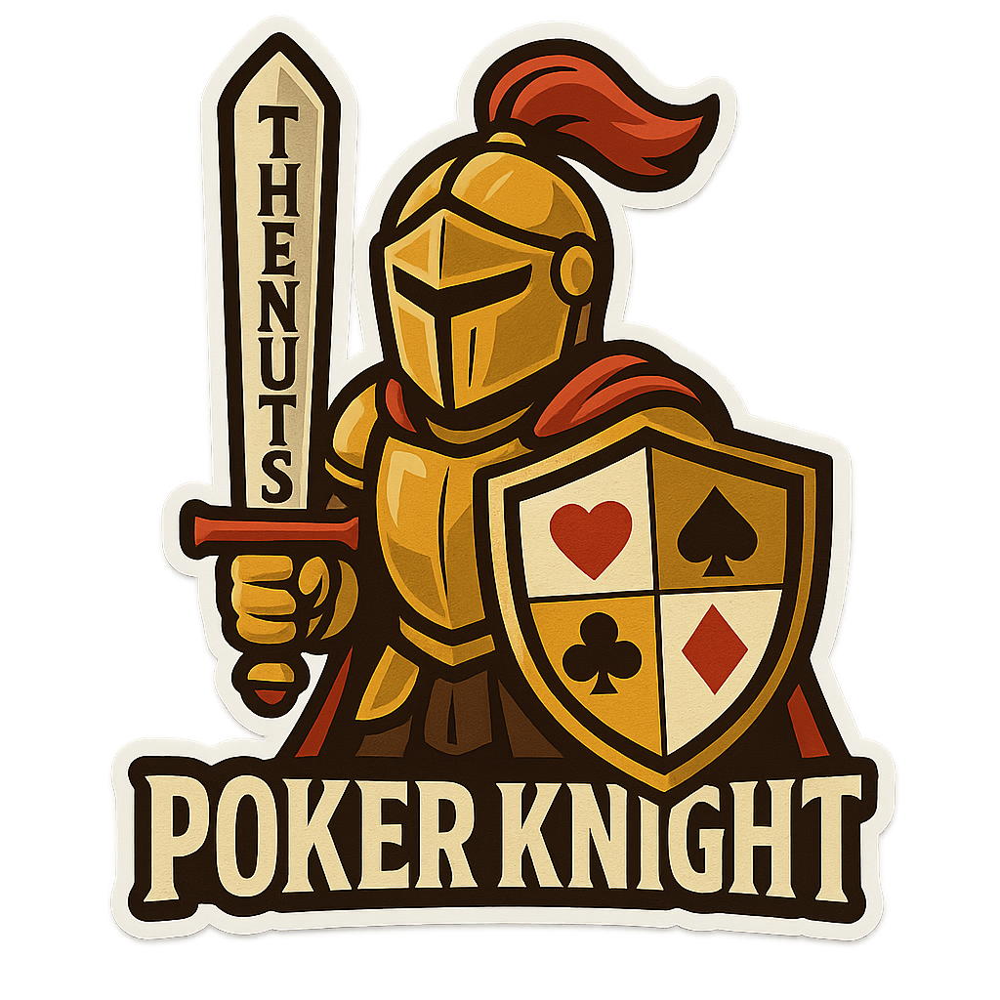

# ♞ Poker Knight

<div align="center">
  
  
  **A high-performance Monte Carlo Texas Hold'em poker solver designed for AI poker players and real-time gameplay decision making.**

  [](https://www.python.org/downloads/)
  [](https://opensource.org/licenses/MIT)
  [](CHANGELOG.md)
</div>

## ✨ Features

- **⚡ Fast Monte Carlo Simulations**: Optimized for speed while maintaining accuracy
- **🃏 Unicode Card Representation**: Uses emoji suits (♠️ ♥️ ♦️ ♣️) for clear visualization
- **🎯 Comprehensive Analysis**: Pre-flop, flop, turn, and river support
- **🔄 Card Removal Effects**: Accurate probability calculation accounting for known cards
- **⚙️ Configurable Performance**: Multiple simulation modes (fast/default/precision)
- **📊 Statistical Confidence**: Confidence intervals and detailed hand category analysis
- **🔌 Clean API**: Easy integration into larger poker AI systems

## 🚀 Quick Start

```python
from poker_solver import solve_poker_hand

# Analyze pocket aces pre-flop against 2 opponents
result = solve_poker_hand(['A♠️', 'A♥️'], 2)
print(f"Win probability: {result.win_probability:.1%}")

# Analyze with board cards (flop scenario)
result = solve_poker_hand(
    ['K♠️', 'Q♠️'],           # Hero hand
    3,                        # Number of opponents  
    ['A♠️', 'J♠️', '10♥️']    # Board cards (flop)
)
print(f"Win probability: {result.win_probability:.1%}")
```

## 📋 Requirements

- Python 3.7+
- No external dependencies (uses only standard library)

## 🔧 Installation

Simply copy the files to your project directory:
- `poker_solver.py` - Main Poker Knight implementation
- `config.json` - Configuration settings

## 📖 API Reference

### Main Functions

#### `solve_poker_hand(hero_hand, num_opponents, board_cards=None, simulation_mode="default")`

Convenience function for quick analysis.

**Parameters:**
- `hero_hand`: List of 2 card strings (e.g., `['A♠️', 'K♥️']`)
- `num_opponents`: Number of opponents (1-6)
- `board_cards`: Optional list of 3-5 board cards
- `simulation_mode`: "fast", "default", or "precision"

**Returns:** `SimulationResult` object

### Classes

#### `MonteCarloSolver`

Main Poker Knight solver class for advanced usage.

```python
solver = MonteCarloSolver("config.json")
result = solver.analyze_hand(['A♠️', 'A♥️'], 2)
```

#### `SimulationResult`

Result object containing analysis data:

```python
@dataclass
class SimulationResult:
    win_probability: float              # Probability of winning (0-1)
    tie_probability: float              # Probability of tying (0-1)  
    loss_probability: float             # Probability of losing (0-1)
    simulations_run: int                # Number of simulations executed
    execution_time_ms: float            # Execution time in milliseconds
    confidence_interval: Tuple[float, float]  # 95% confidence interval
    hand_category_frequencies: Dict[str, float]  # Hand type frequencies
```

## 🎯 Card Format

Cards use Unicode emoji suits with standard ranks:

- **Suits**: ♠️ (spades), ♥️ (hearts), ♦️ (diamonds), ♣️ (clubs)
- **Ranks**: A, K, Q, J, 10, 9, 8, 7, 6, 5, 4, 3, 2

**Examples:**
- `'A♠️'` - Ace of spades
- `'K♥️'` - King of hearts  
- `'10♦️'` - Ten of diamonds
- `'2♣️'` - Two of clubs

## ⚙️ Configuration

Edit `config.json` to customize Poker Knight's behavior:

```json
{
  "simulation_settings": {
    "default_simulations": 100000,
    "fast_mode_simulations": 10000,
    "precision_mode_simulations": 500000
  },
  "performance_settings": {
    "max_simulation_time_ms": 5000,
    "early_convergence_threshold": 0.001
  },
  "output_settings": {
    "include_confidence_interval": true,
    "include_hand_categories": true,
    "decimal_precision": 4
  }
}
```

## 📊 Usage Examples

### Pre-flop Analysis

```python
# Premium hand
result = solve_poker_hand(['A♠️', 'A♥️'], 1)
print(f"Pocket Aces: {result.win_probability:.1%}")

# Marginal hand
result = solve_poker_hand(['2♠️', '7♥️'], 5)
print(f"2-7 offsuit: {result.win_probability:.1%}")
```

### Post-flop Analysis

```python
# Strong made hand
result = solve_poker_hand(
    ['A♠️', 'A♥️'],                    # Pocket aces
    2,                                 # 2 opponents
    ['A♦️', '7♠️', '2♣️']             # Flop (trip aces)
)

# Drawing hand
result = solve_poker_hand(
    ['A♠️', 'K♠️'],                    # Suited ace-king
    1,                                 # 1 opponent
    ['Q♠️', 'J♦️', '7♠️']             # Flop (flush + straight draws)
)
```

### Performance Modes

```python
# Fast analysis for real-time decisions
result = solve_poker_hand(['K♠️', 'K♥️'], 3, simulation_mode="fast")

# High precision for critical decisions
result = solve_poker_hand(['K♠️', 'K♥️'], 3, simulation_mode="precision")
```

## 🧪 Testing

Run the test suite:

```bash
python test_poker_solver.py
```

Run examples:

```bash
python example_usage.py
```

## 🎮 Integration Example

```python
class PokerAI:
    def __init__(self):
        self.solver = MonteCarloSolver()
    
    def make_decision(self, hole_cards, board_cards, num_opponents):
        result = self.solver.analyze_hand(
            hole_cards, 
            num_opponents, 
            board_cards,
            simulation_mode="fast"  # Quick decisions
        )
        
        if result.win_probability > 0.7:
            return "bet"
        elif result.win_probability > 0.4:
            return "call"
        else:
            return "fold"
```

## 🔬 Technical Details

### Hand Evaluation

- Supports all standard poker hands (high card through royal flush)
- Handles 5, 6, and 7-card evaluation (finds best 5-card hand)
- Optimized tiebreaker resolution
- Special handling for wheel straights (A-2-3-4-5)

### Monte Carlo Simulation

- Efficient deck management with card removal
- Randomized opponent hand generation
- Complete board simulation for incomplete boards
- Statistical convergence monitoring

### Performance Optimizations

- Pre-computed hand rankings
- Minimal object allocation during simulation
- Fast card comparison and evaluation
- Time-bounded execution with early termination

## 📈 Performance Benchmarks

Typical performance on modern hardware:

| Mode | Simulations | Time | Accuracy |
|------|-------------|------|----------|
| Fast | 10,000 | ~50ms | ±2% |
| Default | 100,000 | ~500ms | ±0.5% |
| Precision | 500,000 | ~2.5s | ±0.2% |

## 🤝 Contributing

Poker Knight is designed as a component for AI poker systems. Key areas for enhancement:

- **Opponent Modeling**: Support for opponent hand ranges
- **Position Awareness**: Integration with betting position
- **Pot Odds**: Expected value calculations
- **Multi-threading**: Parallel simulation execution

## 📄 License

This project is provided as-is for educational and development purposes.

## 🎯 Use Cases

- **🤖 AI Poker Bots**: Core decision-making component
- **📚 Training Tools**: Hand strength analysis for learning
- **📊 Game Analysis**: Post-game hand review and analysis
- **🔬 Research**: Poker probability and game theory studies

---

**Poker Knight v1.0.0** - Empowering AI poker players with precise, fast hand analysis. 