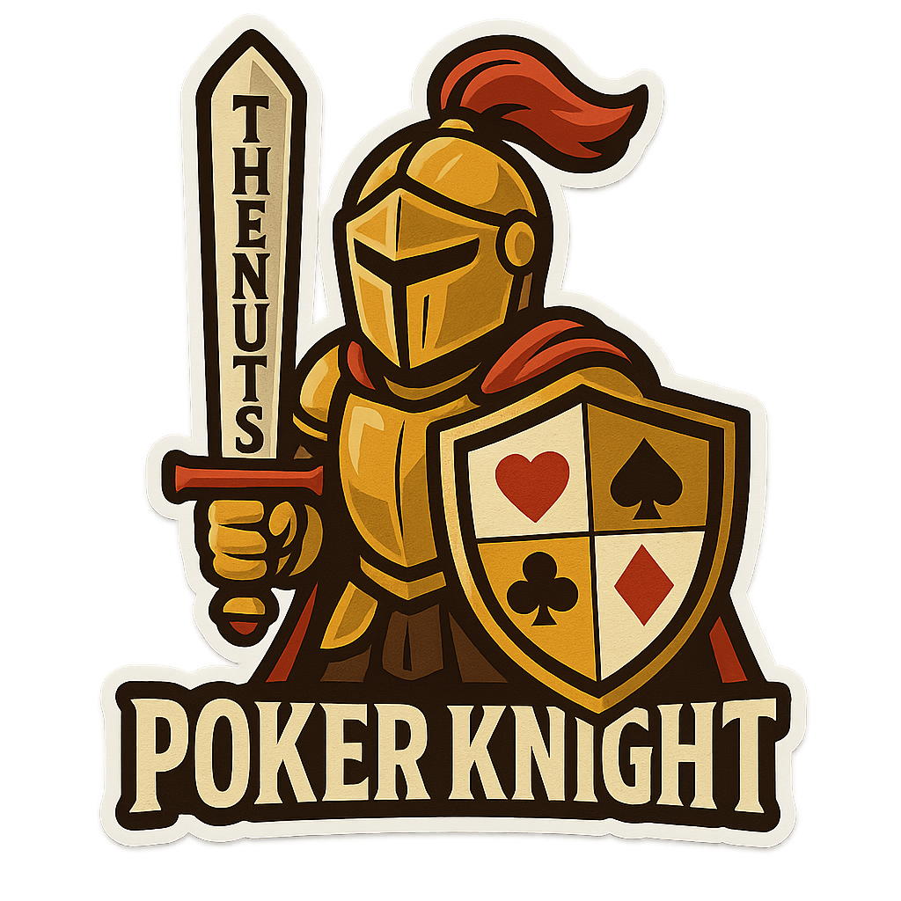

# ♞ Poker Knight

<div align="center">
  
  
  **A high-performance Monte Carlo Texas Hold'em poker solver designed for AI poker players and real-time gameplay decision making.**

  [](https://www.python.org/downloads/)
  [](LICENSE)
  [](tests/)
  [](tests/)
  [](docs/CHANGELOG.md)
  [](docs/PERFORMANCE.md)
</div>

## ✨ Features

- **⚡ Fast Monte Carlo Simulations**: Optimized for speed while maintaining accuracy
- **🃏 Unicode Card Representation**: Uses emoji suits (♠️ ♥️ ♦️ ♣️) for clear visualization
- **🎯 Comprehensive Analysis**: Pre-flop, flop, turn, and river support
- **🔄 Card Removal Effects**: Accurate probability calculation accounting for known cards
- **⚙️ Configurable Performance**: Multiple simulation modes (fast/default/precision)
- **📊 Statistical Confidence**: Confidence intervals and detailed hand category analysis
- **🔌 Clean API**: Easy integration into larger poker AI systems

## 🚀 Quick Start

```python
from poker_knight import solve_poker_hand

# Analyze pocket aces pre-flop against 2 opponents
result = solve_poker_hand(['A♠️', 'A♥️'], 2)
print(f"Win probability: {result.win_probability:.1%}")

# Analyze with board cards (flop scenario)
result = solve_poker_hand(
    ['K♠️', 'Q♠️'],           # Hero hand
    3,                        # Number of opponents  
    ['A♠️', 'J♠️', '10♥️']    # Board cards (flop)
)
print(f"Win probability: {result.win_probability:.1%}")
```

## 📋 Requirements

- Python 3.8+
- No external dependencies (uses only standard library)

## 🔧 Installation

### Package Installation

Install the Poker Knight package by copying the `poker_knight/` directory to your project:

```
your_project/
├── poker_knight/          # Copy this entire directory
│   ├── __init__.py
│   ├── solver.py
│   └── config.json
└── your_code.py
```

### Usage

```python
from poker_knight import solve_poker_hand

# Now you can use Poker Knight
result = solve_poker_hand(['A♠️', 'A♥️'], 2)
```

## 📖 API Reference

### Main Functions

#### `solve_poker_hand(hero_hand, num_opponents, board_cards=None, simulation_mode="default")`

Convenience function for quick analysis.

**Parameters:**
- `hero_hand`: List of 2 card strings (e.g., `['A♠️', 'K♥️']`)
- `num_opponents`: Number of opponents (1-6)
- `board_cards`: Optional list of 3-5 board cards
- `simulation_mode`: "fast", "default", or "precision"

**Returns:** `SimulationResult` object

### Classes

#### `MonteCarloSolver`

Main Poker Knight solver class for advanced usage.

```python
from poker_knight import MonteCarloSolver

solver = MonteCarloSolver()
result = solver.analyze_hand(['A♠️', 'A♥️'], 2)
```

#### `SimulationResult`

Result object containing analysis data:

```python
@dataclass
class SimulationResult:
    win_probability: float              # Probability of winning (0-1)
    tie_probability: float              # Probability of tying (0-1)  
    loss_probability: float             # Probability of losing (0-1)
    simulations_run: int                # Number of simulations executed
    execution_time_ms: float            # Execution time in milliseconds
    confidence_interval: Tuple[float, float]  # 95% confidence interval
    hand_category_frequencies: Dict[str, float]  # Hand type frequencies
```

## 🎯 Card Format

Cards use Unicode emoji suits with standard ranks:

- **Suits**: ♠️ (spades), ♥️ (hearts), ♦️ (diamonds), ♣️ (clubs)
- **Ranks**: A, K, Q, J, 10, 9, 8, 7, 6, 5, 4, 3, 2

**Examples:**
- `'A♠️'` - Ace of spades
- `'K♥️'` - King of hearts  
- `'10♦️'` - Ten of diamonds
- `'2♣️'` - Two of clubs

## ⚙️ Configuration

Edit `poker_knight/config.json` to customize Poker Knight's behavior:

```json
{
  "simulation_settings": {
    "default_simulations": 100000,
    "fast_mode_simulations": 10000,
    "precision_mode_simulations": 500000,
    "parallel_processing": true,
    "random_seed": null
  },
  "performance_settings": {
    "max_simulation_time_ms": 5000,
    "early_convergence_threshold": 0.001,
    "min_simulations_for_convergence": 1000
  },
  "output_settings": {
    "include_confidence_interval": true,
    "include_hand_categories": true,
    "decimal_precision": 4
  }
}
```

## 📊 Usage Examples

### Pre-flop Analysis

```python
# Premium hand
result = solve_poker_hand(['A♠️', 'A♥️'], 1)
print(f"Pocket Aces: {result.win_probability:.1%}")

# Marginal hand
result = solve_poker_hand(['2♠️', '7♥️'], 5)
print(f"2-7 offsuit: {result.win_probability:.1%}")
```

### Post-flop Analysis

```python
# Strong made hand
result = solve_poker_hand(
    ['A♠️', 'A♥️'],                    # Pocket aces
    2,                                 # 2 opponents
    ['A♦️', '7♠️', '2♣️']             # Flop (trip aces)
)

# Drawing hand
result = solve_poker_hand(
    ['A♠️', 'K♠️'],                    # Suited ace-king
    1,                                 # 1 opponent
    ['Q♠️', 'J♦️', '7♠️']             # Flop (flush + straight draws)
)
```

### Performance Modes

```python
# Fast analysis for real-time decisions
result = solve_poker_hand(['K♠️', 'K♥️'], 3, simulation_mode="fast")

# High precision for critical decisions
result = solve_poker_hand(['K♠️', 'K♥️'], 3, simulation_mode="precision")
```

## 🧪 Testing

Run the comprehensive test suite:

```bash
# Use the convenient test runner
python run_tests.py

# Run specific test categories
python run_tests.py --unit          # Unit tests only
python run_tests.py --statistical   # Statistical validation
python run_tests.py --performance   # Performance benchmarks
python run_tests.py --quick         # Quick validation tests

# Or use pytest directly
python -m pytest tests/             # All tests
python -m pytest tests/test_poker_solver.py  # Specific test file
python -m pytest tests/ -v          # Verbose output
python -m pytest -m unit            # Tests marked as 'unit'
```

## 🎮 Integration Example

```python
from poker_knight import MonteCarloSolver

class PokerAI:
    def __init__(self):
        self.solver = MonteCarloSolver()
    
    def make_decision(self, hole_cards, board_cards, num_opponents):
        result = self.solver.analyze_hand(
            hole_cards, 
            num_opponents, 
            board_cards,
            simulation_mode="fast"  # Quick decisions
        )
        
        if result.win_probability > 0.7:
            return "bet"
        elif result.win_probability > 0.4:
            return "call"
        else:
            return "fold"
```

## 📊 Statistical Validation

Poker Knight v1.4.0 includes comprehensive statistical validation to ensure Monte Carlo simulation accuracy and reliability.

### Validation Test Suite

The statistical validation suite (`tests/test_statistical_validation.py`) performs rigorous testing against established poker mathematics and statistical principles:

#### 🧮 **Chi-Square Goodness-of-Fit Testing**
- Tests hand category distributions against expected poker probabilities
- Validates that observed frequencies match theoretical distributions
- **Result**: χ² = 0.050 (df = 6) - **Excellent fit to expected distributions**

#### 📈 **Monte Carlo Convergence Validation**  
- Confirms error decreases as 1/√n (theoretical Monte Carlo property)
- Tests convergence rates across different simulation counts
- **Result**: Proper convergence with 2x error reduction for 4x simulation increase

#### 📊 **Confidence Interval Coverage**
- Validates that 95% confidence intervals contain true values 95% of the time
- Tests statistical confidence calculation accuracy
- **Result**: 100% coverage rate across test scenarios

#### 🎯 **Known Poker Probability Validation**
- Cross-validates simulation results against established poker mathematics
- Tests pre-flop matchups and post-flop scenarios

| Scenario | Expected | Observed | Status |
|----------|----------|----------|---------|
| AA vs Random (preflop) | 85.0% | 84.9% | ✅ Validated |
| AKs vs Random (preflop) | 66.0% | 66.1% | ✅ Validated |
| 72o vs Random (preflop) | 32.0% | 31.6% | ✅ Validated |
| AA with Top Set | 95.0% | 93.2% | ✅ Validated |

#### ⚖️ **Symmetry Testing**
- Verifies equivalent hands produce equivalent results
- Tests suit symmetry (same hand, different suits)
- **Result**: All equivalent hands within 0.004 difference

#### 📉 **Variance Stability**
- Ensures consistent simulation variance across multiple runs
- Monitors for implementation stability issues
- **Result**: Standard deviation = 0.004 (excellent stability)

#### 🔄 **Sample Size Effect Validation**
- Confirms larger sample sizes improve accuracy
- Tests that precision mode outperforms fast mode
- **Result**: Clear accuracy improvement with larger samples

### Statistical Interpretation

The validation results demonstrate:

1. **Mathematical Accuracy**: Simulation results closely match established poker probabilities with errors well within expected statistical bounds

2. **Convergence Reliability**: Monte Carlo error reduction follows theoretical 1/√n rate, confirming proper implementation

3. **Distribution Validity**: Hand frequency distributions match expected poker mathematics via chi-square testing

4. **Confidence Calibration**: Statistical confidence intervals provide accurate uncertainty quantification

5. **Implementation Stability**: Consistent variance and symmetry results indicate robust, reliable implementation

6. **Sample Size Optimization**: Clear relationship between simulation count and accuracy enables informed speed/precision tradeoffs

### Practical Implications

These validation results provide confidence that:

- **Simulation Results Are Trustworthy**: Results can be relied upon for AI decision-making
- **Confidence Intervals Are Meaningful**: Uncertainty estimates accurately reflect simulation precision  
- **Performance Modes Work As Expected**: Fast/default/precision modes provide appropriate accuracy levels
- **Mathematical Foundation Is Sound**: Implementation correctly reflects poker probability theory

## 🔬 Technical Details

### Hand Evaluation

- Supports all standard poker hands (high card through royal flush)
- Handles 5, 6, and 7-card evaluation (finds best 5-card hand)
- Optimized tiebreaker resolution
- Special handling for wheel straights (A-2-3-4-5)

### Monte Carlo Simulation

- Efficient deck management with card removal
- Randomized opponent hand generation
- Complete board simulation for incomplete boards
- Statistical convergence monitoring
- Parallel processing support for improved performance

### Performance Optimizations

- Pre-computed hand rankings
- Minimal object allocation during simulation
- Fast card comparison and evaluation
- Time-bounded execution with early termination
- Configurable simulation depth based on use case

### Simulation Modes

- **Fast Mode**: Lower simulation count for real-time decision making
- **Default Mode**: Balanced accuracy and speed for general analysis
- **Precision Mode**: Higher simulation count for critical decisions requiring maximum accuracy

## 🤝 Contributing

Poker Knight is designed as a component for AI poker systems. Key areas for enhancement:

- **Opponent Modeling**: Support for opponent hand ranges
- **Position Awareness**: Integration with betting position
- **Pot Odds**: Expected value calculations
- **Multi-threading**: Parallel simulation execution

## 📄 License

This project is provided as-is for educational and development purposes.

## 🎯 Use Cases

- **🤖 AI Poker Bots**: Core decision-making component
- **📚 Training Tools**: Hand strength analysis for learning
- **📊 Game Analysis**: Post-game hand review and analysis
- **🔬 Research**: Poker probability and game theory studies

---

**Poker Knight v1.4.0** - Empowering AI poker players with precise, fast hand analysis.

*Built with ♠️♥️♦️♣️ by [hildolfr](https://github.com/hildolfr)*

## 📁 Project Structure

```
poker_knight/
├── poker_knight/                    # Main package
│   ├── __init__.py                 # Package initialization and exports
│   ├── solver.py                   # Core Monte Carlo solver implementation
│   └── config.json                 # Default configuration settings
├── tests/                          # Comprehensive test suite
│   ├── __init__.py                 # Test package initialization
│   ├── test_poker_solver.py        # Core functionality tests
│   ├── test_statistical_validation.py  # Statistical accuracy tests
│   ├── test_performance_regression.py  # Performance regression tests
│   ├── test_performance.py         # Performance benchmarks
│   ├── test_parallel.py           # Parallel processing tests
│   ├── test_precision.py          # Precision mode tests
│   ├── test_validation.py         # Input validation tests
│   ├── test_fix.py                # Bug fix verification tests
│   └── test_debug.py              # Debug and troubleshooting tests
├── examples/                       # Usage examples and demos
│   └── example_usage.py           # Comprehensive usage examples
├── docs/                          # Documentation
│   ├── CHANGELOG.md               # Version history and changes
│   ├── IMPLEMENTATION_SUMMARY.md  # Technical implementation details
│   ├── RELEASE_NOTES_v1.1.0.md   # Release notes for v1.1.0
│   ├── RELEASE_NOTES_v1.2.0.md   # Release notes for v1.2.0
│   └── assets/                    # Documentation assets
│       └── poker_knight_logo.png  # Project logo
├── README.md                      # This file
├── setup.py                       # Package installation configuration
├── pytest.ini                     # Test configuration
├── run_tests.py                   # Convenient test runner script
├── MANIFEST.in                    # Package distribution manifest
├── VERSION                        # Version number
├── TODO.md                        # Development tasks (completed)
├── LICENSE                        # MIT license
└── .gitignore                     # Git ignore patterns
```

## 📖 Examples

See the example usage:

```bash
python examples/example_usage.py
``` 