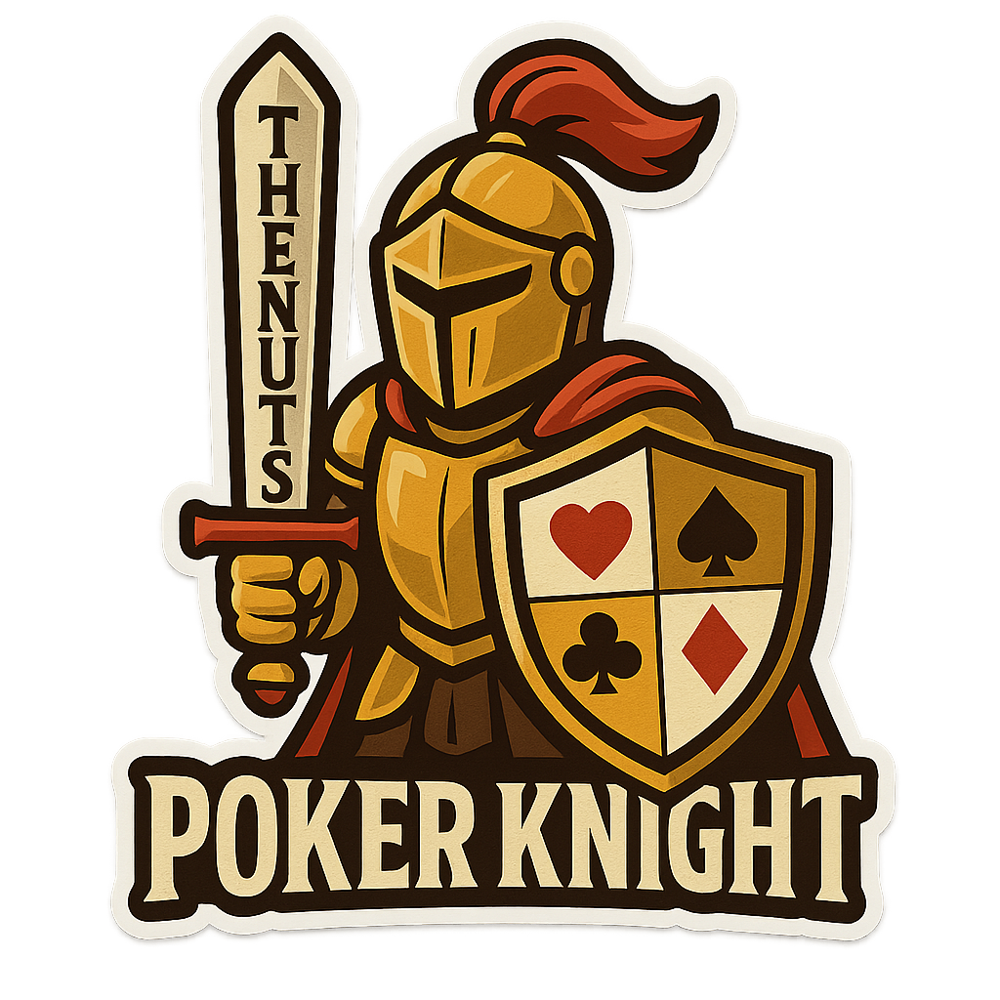

# 🧪 Poker Knight Test Report

<div align="center">



**Test Report Generated**: June 10, 2025 at 02:01 PM

</div>

## 📊 Overall Status

<div align="center">


### 100.0% Success Rate

</div>

- 📅 **Test Run**: June 10, 2025 at 02:01 PM
- 🧪 **Total Tests**: 153
- ⏱️ **Exit Status**: 0

## 📈 Test Summary

| Metric | Count | Percentage |
|--------|-------|------------|
| ✅ Passed | 153 | 100.0% |
| ❌ Failed | 0 | 0.0% |
| 💥 Errors | 0 | 0.0% |
| ⏭️ Skipped | 0 | 0.0% |

## 🎯 Test Details

**Test Category**: ALL

## ⚙️ Test Configuration

**Latest test run configuration:**
```json
{
  "quick": false,
  "statistical": false,
  "performance": false,
  "stress": false,
  "unit": false,
  "numa": false,
  "all": false,
  "with_coverage": false
}
```

## 🔍 Test Analysis

✅ **Overall Status: PASS**

### Regression Indicators:
- Has Failures: No
- Has Errors: No
- Below Success Threshold: No

## 📋 Comprehensive Test Suite

Poker Knight's test suite validates every aspect of the solver, from basic card handling to advanced GPU acceleration.

### ⚡ Performance

**`test_performance.py`** - Performance benchmarks and optimization

- `test_fast_mode_performance()` - 10k simulations benchmark
- `test_default_mode_performance()` - 100k simulations benchmark
- `test_precision_mode_performance()` - 500k simulations benchmark
- `test_memory_efficiency()` - Memory usage optimization

### ⚡ Quick Multi-Way

**`test_multiway_quick.py`** - Fast multi-way pot tests


### ✅ Input Validation

**`test_validation.py`** - Input validation and error handling


### 🃏 Card Handling

**`test_card_formats.py`** - Card format parsing and validation


### 🎯 Core Functionality

**`test_poker_solver.py`** - Main solver implementation tests

- `test_basic_functionality()` - Core solver operations
- `test_solve_poker_hand_function()` - Main API functionality
- `test_simulation_modes()` - Fast/default/precision modes
- `test_invalid_inputs()` - Error handling and validation
- `test_board_scenarios()` - Flop, turn, river scenarios

### 🎯 Precision Testing

**`test_precision.py`** - Numerical precision validation


### 👥 Multi-Way Pots

**`test_multi_way_scenarios.py`** - Multi-player scenario tests


### 💪 Forced Parallel

**`test_force_advanced_parallel.py`** - Forced parallel execution tests


### 💪 Stress Testing

**`test_stress_scenarios.py`** - Stress and load tests


### 📈 Statistical Validation

**`test_statistical_validation.py`** - Statistical accuracy tests

- `test_known_probabilities()` - Validates against known poker odds
- `test_confidence_intervals()` - Statistical confidence testing
- `test_variance_analysis()` - Monte Carlo variance properties
- `test_hand_distribution()` - Hand frequency validation

### 📉 Convergence

**`test_convergence.py`** - Monte Carlo convergence tests


### 📊 Enhanced Convergence

**`test_enhanced_convergence.py`** - Advanced convergence analysis


### 📊 Performance Regression

**`test_performance_regression.py`** - Performance regression tests


### 🔄 Parallel Processing

**`test_parallel.py`** - Parallel execution tests


### 🔍 Edge Cases

**`test_edge_cases_extended.py`** - Extended edge case testing


### 🖥️ NUMA Testing

**`test_numa.py`** - Non-Uniform Memory Access tests


### 🚀 Advanced Parallel

**`test_advanced_parallel.py`** - Advanced parallel processing


### 🚀 GPU/CUDA Integration

**`test_cuda_integration.py`** - GPU acceleration tests

- `test_gpu_available()` - Detects NVIDIA GPU availability
- `test_cuda_kernel_compilation()` - Validates CUDA kernel compilation
- `test_gpu_vs_cpu_accuracy()` - Ensures GPU results match CPU exactly
- `test_gpu_performance_scaling()` - Measures GPU speedup factors
- `test_automatic_fallback()` - Tests CPU fallback when GPU unavailable

### 🛡️ Safe Runner

**`test_runner_safe.py`** - Safe test execution framework


### 🧠 Smart Sampling

**`test_smart_sampling.py`** - Intelligent sampling strategies


---

*This report is automatically generated from test results in `tests/results/`*

**Poker Knight v1.8.0** | [View on GitHub](https://github.com/hildolfr/poker_knight)